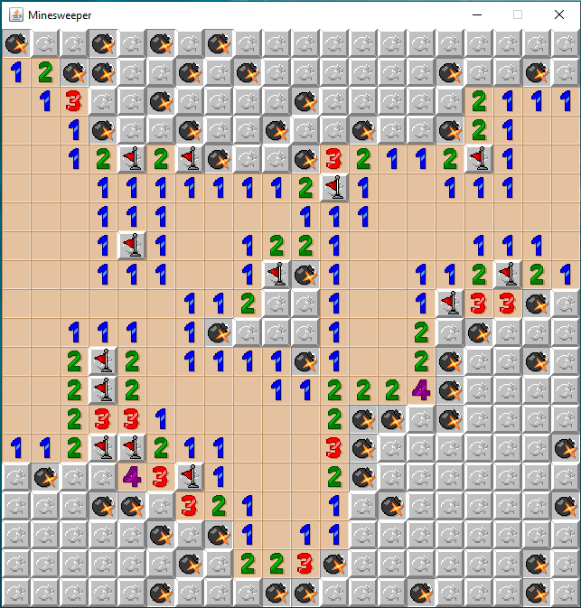

## Minesweeper

Esse projeto é uma recriação do jogo "Minesweeper" e codificado em Java. 

## Como executar

- Instale e configure o Java em sua máquina
- Baixe e descompacte o arquivo .zip do jogo
- Abra o prompt de comando no diretório onde os arquivos foram descompactados
- Digite os seguintes comandos:
    - cd src
    - javac *.java
    - java Minesweeper